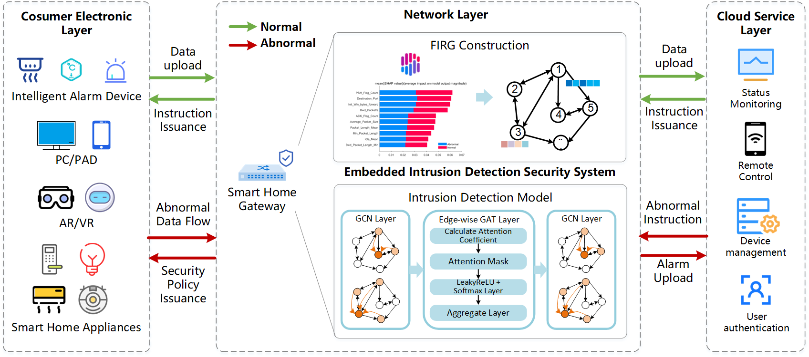
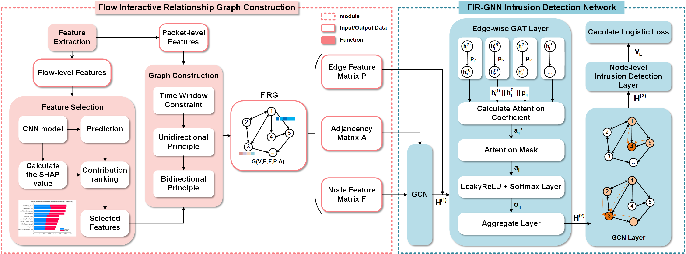

# FIR-GNN: A Graph Neural Network using Flow Interaction Relationships for Intrusion Detection of Consumer Electronics in Smart Home Network



## Abstract

In the smart home scenario, the Consumer Internet of Things (CIoT) deeply integrates into daily life with various Consumer Electronics (CEs) like home cameras, smart speakers, smoke/fire detectors, VR/AR game boxes/handles, and future home medical terminals. However, CEs face multiple risks due to attack concealment and protocol differences. Against this backdrop, embedding Network Intrusion Detection System (NIDS) in the smart home gateway is proposed. Despite Machine Learning (ML) and Deep Learning (DL) enhancing network intrusion detection, challenges remain in sample collection, traffic feature expression, and gateway resource constraints. To address these, we propose FIR-GNN. It constructs a FIRG graph for traffic pattern capture, uses edge-wise graph attention in FIR-GNN for semi-supervised learning, and selects features by SHAP to cut resource consumption. Experiments show FIR-GNN improves classification performance by 3-5% on BoT-IoT and CICIDS2017 data, safeguarding smart home CEs.



## Use

Before start constructing, you may refer to **configs/default.yaml** and customize all your own file paths.

```yaml
dataset:
  name: CICIDS
  dataset_dir: data/CSV/CICIDS/
  processed_dir: data/Graph/CICIDS/
  label_level: Application
  per_class: 1000
  pkt_num: 3
  window_t: 10

model:
  name: FIR-GNN
  hidden: 32
  heads: 2

train:
  exp: AC
  lr: 0.01
  epochs: 300
  label_ratio: 0.8
  device: cuda
```

Then, run the following commands to start constructing.

```
python generate_graph.py
```


Then, run the following commands to start training and testing.

```
python train.py
```

## Citation

```bibtex
@ARTICLE{10915555,
  author={Fu, Mengyi and Wang, Pan and Liu, Shidong and Chen, Xuejiao and Zhou, Xiaokang},
  journal={IEEE Transactions on Consumer Electronics}, 
  title={FIR-GNN: A Graph Neural Network using Flow Interaction Relationships for Intrusion Detection of Consumer Electronics in Smart Home Network}, 
  year={2025},
  volume={},
  number={},
  pages={1-1},
  keywords={Smart homes;Feature extraction;Logic gates;Security;Graph neural networks;Consumer electronics;Training;Network intrusion detection;Deep learning;Telecommunication traffic;Network intrusion detection;graph neural networks;smart home gateways;graph attention networks;consumer electronicsss},
  doi={10.1109/TCE.2025.3548798}}

```
