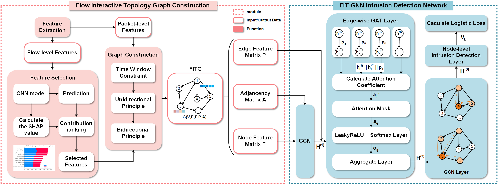
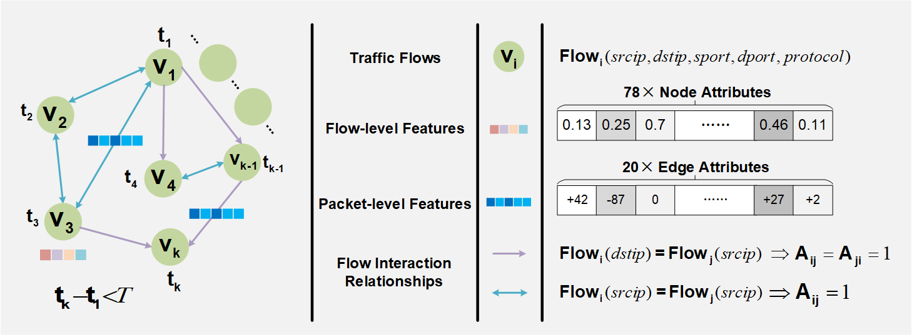

# FIR-GNN: Enhancing IoT Security Through Catching Flow Interaction Relationships for Network Intrusion Detections

## Abstract
The Network Intrusion Detection System (NIDS) plays a crucial role in ensuring system security, protecting user privacy, and maintaining service quality for the CPS embedded system of the home smart gateway. Although Machine Learning (ML) and Deep Learning (DL) techniques have significantly enhanced NIDS performance, challenges persist, particularly in the effective representation of network traffic features. The diversity and ubiquity of smart home devices further complicate these challenges. To overcome these limitations, we introduce a novel network traffic representation method called FIRG (Flow Interactive Relationship Graph), which leverages graph structures to enhance the representation of network traffic. Unlike other GNN-based network traffic representation methods, FIRG transforms traffic data into a directional graph, utilizing flow interactions between IP hosts while integrating packet and flow-level features to capture time series, spatial characteristics, and flow relationships. Building on FIRG, we propose a GNN-based NIDS method named FIR-GNN (Flow Interaction Relationship Graph Nerual Network), which combines Graph Convolutional Networks (GCN) and Graph Attention Networks (GAT) to effectively detect intrusion traffic while ensuring strong robustness and generalization. We evaluate our method on the BoT-IoT and CICIDS datasets, comparing it against state-of-the-art approaches. Results demonstrate that FIR-GNN achieves superior classification performance, enhancing both robustness and generalization capabilities.

